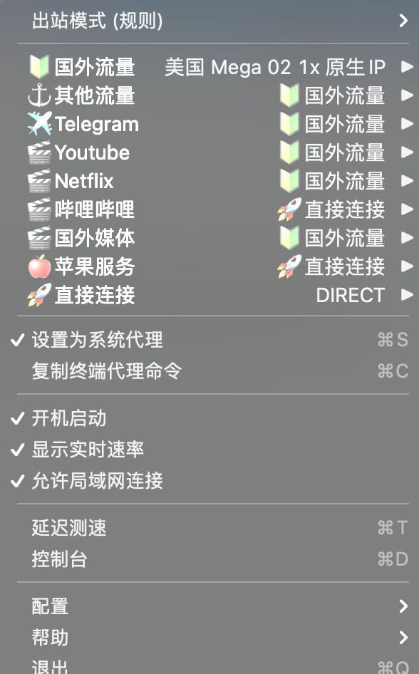
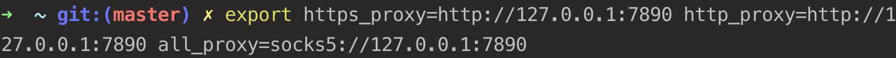
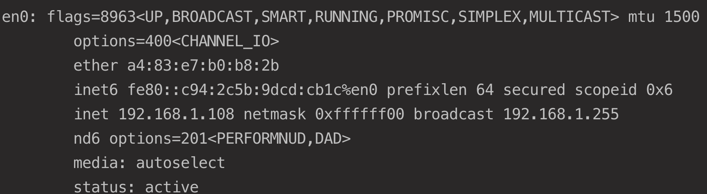
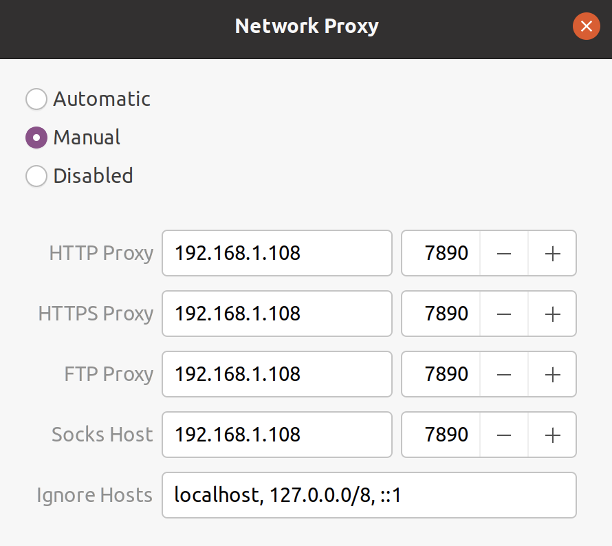

# Ubuntu

## 设置代理

### 主机设置

主机Mac，使用 ClashX，VMware Fusion，Ubuntu 版本为 Ubuntu 20.04.3 LTS。

ClashX 的设置如下，一定要勾选 `允许局域网连接`：



查看 ClashX 设置的代理端口，可通过 `复制终端代理命令` 查看。



使用 `ifconfig` 查看主机 IP 地址：



### 虚拟机设置

网络连接方式为桥接，NAT没有试过。

设置如下网络代理：



此时浏览器即可访问外网，但是 Terminal 还要输入以下内容：

```bash
export https_proxy=http://192.168.1.108:7890 http_proxy=http://192.168.1.108:7890 all_proxy=socks5://192.168.1.108:7890
```

Done!